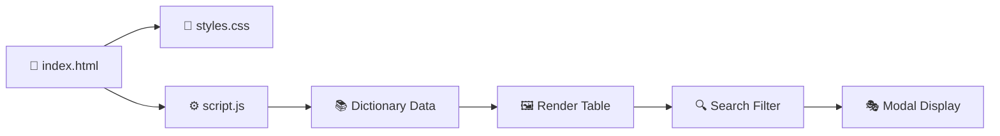

# refactored-octo-barnacle
w3css and w3.js example with css fallback

# 📚✨ Refactored Octo Barnacle ✨

<div align="center">


### 🦑 **Where Words Meet Wonder!** 🌟

*A Beautiful, Interactive Dictionary Web App*

[🚀 Live Demo](#) • [📖 Documentation](#) • [🐛 Report Bug](#) • [💡 Request Feature](#)

</div>

---

## 🎨 **Preview**

<div align="center">


*✨ Click words to discover their magic! ✨*

</div>

---

## 🌈 **Features**

<table>
<tr>
<td width="50%">

### ⚡ **Core Features**
- 🔍 **Smart Search** - Find words instantly
- 📖 **Rich Definitions** - Detailed meanings & examples
- 🎯 **Click to Explore** - Interactive word cards
- 📱 **Fully Responsive** - Works on all devices
- 🎨 **Beautiful UI** - W3.CSS powered design

</td>
<td width="50%">

### 🚀 **Bonus Features**
- 📋 **Copy JSON** - One-click data export
- 👁️ **JSON Preview** - Toggle data view
- 🎭 **Modal Popups** - Elegant word details
- 🌊 **Smooth Animations** - Delightful UX
- 💾 **No Database** - Pure client-side magic

</td>
</tr>
</table>

---

## 🛠️ **Tech Stack**

<div align="center">


**🎯 Pure Frontend Magic - No Frameworks, No Problems!**

</div>

---

## 🎯 **Quick Start**

### 📥 **Installation**

```bash
# 1. Clone the repository
git clone https://github.com/yourusername/refactored-octo-barnacle.git

# 2. Navigate to the project
cd refactored-octo-barnacle

# 3. Open index.html in your browser
# That's it! No build process needed! 🎉
```

### 🌐 **Usage**

1. **🔍 Search**: Type any word in the search bar
2. **👆 Click**: Click on any word to see details
3. **📋 Copy**: Export the entire dictionary as JSON
4. **👁️ Preview**: Toggle JSON data visibility

---

## 📖 **How It Works**



---

## 🎨 **Color Palette**

<div align="center">

| Color | Hex | Usage |
|-------|-----|-------|
| 🔵 Blue | `#2196F3` | Primary Actions |
| 🟢 Green | `#4CAF50` | Success States |
| ⚫ Dark Grey | `#616161` | Headers |
| ⚪ White | `#FFFFFF` | Cards/Background |
| 🌊 Teal | `#009688` | Part of Speech |

</div>

---

## 📂 **Project Structure**

```
refactored-octo-barnacle/
│
├──  index.html          # Main HTML structure
├── 🎨 styles.css          # All styling & W3.CSS fallback
├── ⚙️ script.js           # Interactive functionality
├── 📚 README.md           # You are here! 🎉
└── 🌐 w3.css              # Optional local W3.CSS
```

---

## 🌟 **Screenshots**

### 🏠 **Main Interface**


### 🔍 **Search in Action**


### 🎭 **Word Detail Modal**


---

## 🤝 **Contributing**

We love contributions! Here's how you can help:

1. 🍴 **Fork** the project
2. 🌿 **Create** your feature branch (`git checkout -b feature/AmazingFeature`)
3. 💾 **Commit** your changes (`git commit -m 'Add some AmazingFeature'`)
4. 📤 **Push** to the branch (`git push origin feature/AmazingFeature`)
5. 🎯 **Open** a Pull Request

---

## 📝 **License**

Distributed under the **MIT License**. See `LICENSE` for more information.

<div align="center">


</div>

---

## 👥 **Authors**

<div align="center">

**Nani** - *Web Developer* 👨‍

[](https://github.com/yourusername)
[](https://linkedin.com/in/yourprofile)

</div>

---

## 🙏 **Acknowledgments**

- 💙 **W3Schools** for the amazing W3.CSS framework
- 🎨 **Font Awesome** for beautiful icons
-  **Dictionary Data** from various sources
- ⭐ **You** for starring this repo!

---

## 🎪 **Show Your Support**

<div align="center">

**If you like this project, please ⭐ star it!**


**Made with ❤️ and lots of ☕**

</div>

---

<div align="center">

### 🐙 **Happy Coding!** 🎉

*This project is part of the refactored-octo-barnacle organization*

[🔝 Back to Top](#-refactored-octo-barnacle-)

</div>
